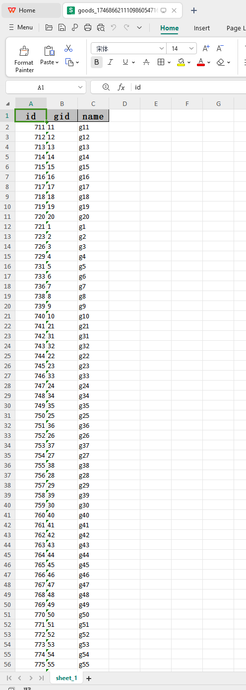
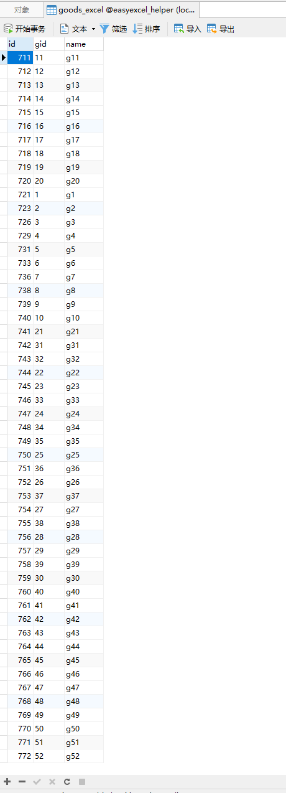
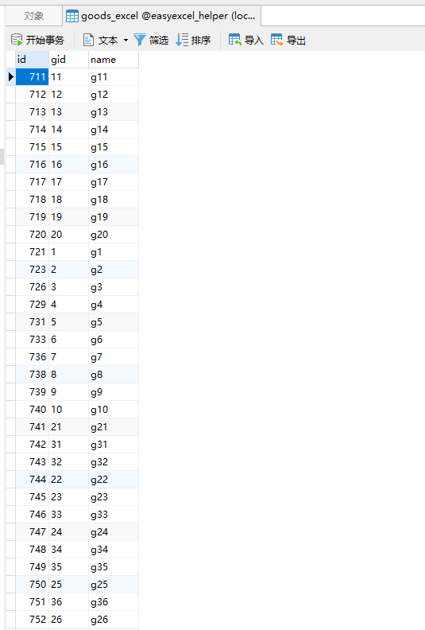

# easyexcel-helper

**本项目的目的在于，抽象easyexcel的处理流程，将行为关注点放于与db的交互上**

目录介绍 
1. comment: excel的处理类抽象和监听类，以及其他辅助性类
2. handler: 具体实现的demo
3. util: 工具类，需重点关注ExcelHelper

### 已实现:
1. 可用于处理基础的excel的读、写，与db交互
2. 使用者只需关注于db的交互，不需要额外创建实体类，全部已Map(Dict)的形式实现
3. 对于大数据量操作，提供async多线程处理写入db操作，对于写入excel，提供分页查询db数据，提供多sheet写入
4. handler包下使用jdbcTemplate作为orm,可以使用其他orm框架，只需实现DbHelper;
5. 导出excel表中head顺序与数据库一致
6. 用户可通过配置参数来决定字段不一致时是否报错，详情见helper前缀开头的配置说明；

### 不足: 
2. 对于写入excel，多sheet情况可使用多线程处理，暂未实现，单线程不确定是否可用多线程
3. 在多线程读取和多线程写入时（单sheet），未保证读取和写入的顺序，可使用临时缓存及间隙下标来实现...

**可参考分支 [v1-entity](https://github.com/chq1024/easyexcel-helper) 实体实现方式，本项目旨在用map取代实体，不需要用户创建对象**

### Demo演示：
#### 1. 调用接口（POST）导出db数据成excel: localhost:20003/excel/download

#### 2. 调用接口（POST）写入excel数据至db: localhost:20003/excel/upload (将刚生成的文件导入)

